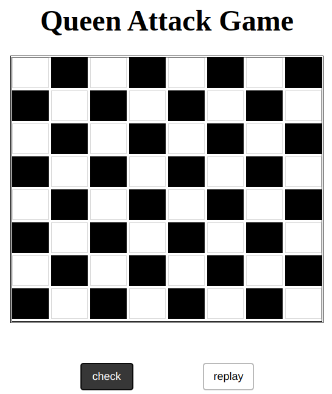

# Queen Attack

This project is named Queen Attack.

## APP

## ABOUT

this project is all about given the position of two queens on a chess board, indicate whether or not they are positioned so that they can attack each other. In the game of chess, a queen can attack pieces that are on the same row, column, or diagonal.

## Built With

- HTML
- CSS
- Google Chrome

## Clone project

- To get a local copy up and running follow these simple example steps.
- Clone this repository with
`https://github.com/kadjialan/Queen-attack-js` using your terminal.
- Change to the project directory by entering: cd wedding in the terminal.

## Command-line steps

- $ git clone `$ https://github.com/kadjialan/Queen-attack-js`
- $ `cd Queen-attack-js`
- $ `git checkout feature/function`

## Start App

- run any browser(google chrome, safari)

## Prerequisites

Knowledge about:

- HTML
- CSS
- JS
- Google Chrome

## Live Site

[Link]( https://kadjialan.github.io/balance-page-js/)

## Author

👤 **Kadji Alan**

- GitHub: [@kadji alan](https://github.com/kadjialan/)

## 🤝 Contributing

Contributions, issues, and feature requests are welcome!

Feel free to check the [issues page](https://github.com/kadjialan/Queen-attack-js/issues).

## Show your support

Give a ⭐️ if you like this project!